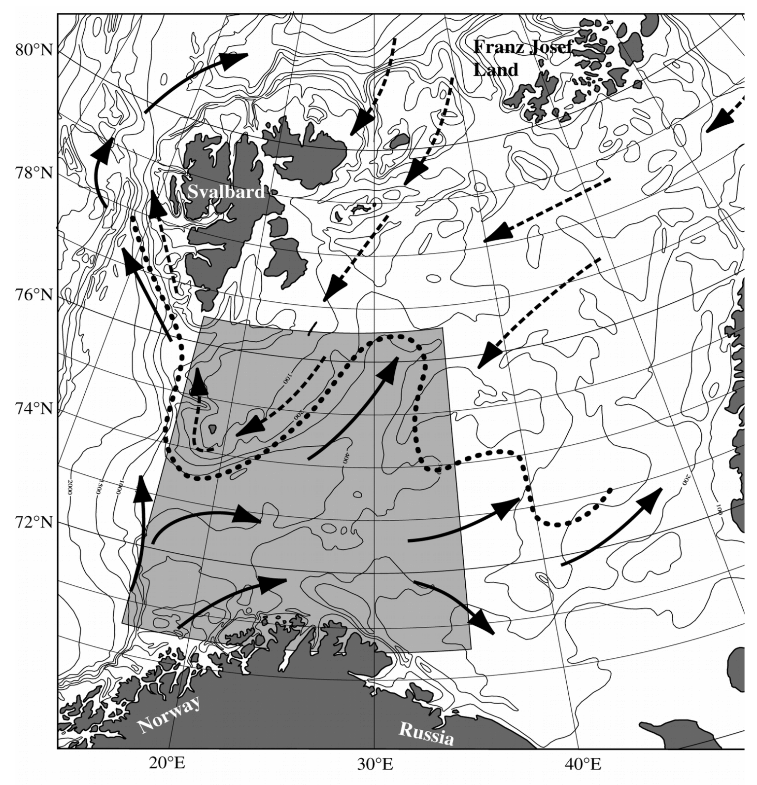

```{r setup, include=FALSE}
knitr::opts_chunk$set(echo = TRUE)
```


```{r packages, message=FALSE, warning=FALSE}
library(extraDistr)
library(ggplot2)
library(knitr)
```

## 1.  The Barents Fish dataset 

Species distribution models (SDM) aim at understanding how environmental conditions affect the abundance of a given species in a given site. The data are typically collected in the following way: $n$ sites are visited and in each site $i$ ($1 \leq i \leq n$) a $d$-dimensional vector $x_i$ of environmental descriptors is recorded, as well as the number $y_i$ of individuals of the species observed in the site.


Map of the Barents sea, where data were collected



@fossheim2006fish measured the abundance of cod ({\it Gadus morhua}) measured in $n=89$ stations of the Barents sea. In each station, fishes were captured according to the same protocole,  the latitude and longitude of each site were measured together with two environmental covariates: depth and temperature of the water. The data are available from the \url{PLNmodels} R package @CMR21. 

 We first give the first few lines of the dataset and the histogram of the observed abundances, which display a large variance  and a high number of observations equal to $0$: the species is actually not observed (i.e. $y_i = 0$) in $n_0 = 61$ stations.


```{r dataBarents, message=FALSE, warning=FALSE}
dataCodBarents <- read.table('BarentsFish.csv', sep=';', header=TRUE)
Covariates <- as.matrix(dataCodBarents[, (2:5)])
Counts <- dataCodBarents[, 6:ncol(dataCodBarents)]
j <- 21 # We focus on Species Ga_mo
Abundance <- Counts[, j]; Presence <- (Abundance>0)
Cod<- as.data.frame(Covariates)
Cod$Abundance <-Abundance 
Cod$Presence <- Presence
```


```{r extract data, eval = TRUE, echo = FALSE}
ggplot(Cod,aes(x=Abundance))+geom_histogram()
kable(Cod[c(1:5,10,11,12),]) 
n <- length(Abundance)

```


We renormalize the covariates.  
```{r suite} 
p <- 1+ncol(Covariates)
Covariates <- as.matrix(scale(Covariates))
Barents <- as.data.frame(cbind(Covariates, Abundance))
names(Barents)[5] <- 'Abundance'
Covariates <- cbind(rep(1, n), Covariates)
colnames(Covariates)[1] <- 'Intercept'
```


## 2. Classical Poisson or logistic regression approaches.
The Poisson regression model (which is special instance of generalized linear models, see Appendix  of the book) provides a natural and well established framework for such count data.
This model states that the sites are all independent and that the mean number of observed individuals in site $i$ depends linearly on the covariates, through the log link function: 


The model can be adapted to account for heterogeneous sampling efforts (e.g. different observation times) by adding an known site-specific offset term $o_i$ to the regression model. 
The unknown parameter $\theta$ is only the vector of regression coefficients $\beta$, its estimation (by maximizing the likelihood) and interpretation are straightforward.

```{r Poisson GLM}
# Poisson regression model for the Abundance
regP <- glm(Abundance ~ Latitude + Longitude + Depth + Temperature, data=Barents, family='poisson')
summary(regP)
regP$beta <- regP$coefficients
```


Alternatively, one may aim at understanding the drivers of the simple presence of the species in each site. 
One way is to consider the binary variable  which equal to $1$ is the count is strictly positive, $0$ otherwise and to use a logistic regression model:
```{r  Logistic}
Barents$Presence = 1*(Barents$Abundance>0)
regL <- glm(Presence ~  Latitude + Longitude + Depth + Temperature, data=Barents, family='binomial')
regL$alpha <- regL$coefficients
regL$linPred <- as.vector(Covariates%*%regL$alpha)
logLik(regL)
summary(regL)
```

This model also suffers limitation, because the presence of the species is not directly observed. Indeed, whenever the species is not observed ($Y_i = 0$), it is not possible to decide whether it is actually absent from the site, or simply unobserved (the two cases are sometimes referred to as 'true zero' versus 'false zero').


## 3. ZIP model 

We consider the ZIP model presented in the Class.  


## 2. EM algorithm for multivariate gaussian distributions 


### 2.a Functions  
The useful functions are in the file `FunctionsZIPreg.R`. 


```{r  EM functions}
source('FunctionsZIPreg.R')
```

Have a look at the codes

### 2.b Run the  EM  

```{r initialisation} 
thetaInit <- InitZIP(X=Covariates, Y=Abundance)
em <- EMZIPreg(X=Covariates, Y=Abundance, thetaInit=thetaInit)
```

We also consider alternative methods : a direct optimization and we use the R package `pscl`
We will compare the performances of the methods by comparing the final Log Likelihoods. 

```{r Direct optim}  
# Direct optimization
opt <- optim(unlist(thetaInit), f=LogLikZIP, Y=Abundance, X=Covariates, control=list(fnscale=-1))
opt$alpha <- opt$par[1:ncol(Covariates)]; opt$beta <- opt$par[-(1:ncol(Covariates))]
opt$theta <- list(alpha=opt$alpha, beta=opt$beta)
# Package
```

```{r pscl}
library(pscl)
fit <- zeroinfl(Abundance ~ -1 + Covariates, dist="poisson")
fit$theta <- list(alpha=fit$coefficients$zero, beta=fit$coefficients$count)

LL <- c(LogLikZIP(unlist(thetaInit), X=Covariates, Y=Abundance), 
  LogLikZIP(unlist(opt$theta), X=Covariates, Y=Abundance), 
  LogLikZIP(unlist(fit$theta), X=Covariates, Y=Abundance),
  LogLikZIP(unlist(em$theta), X=Covariates, Y=Abundance))
names(LL) = c('Init','Optim','pscl',"EM")
print(LL)
```

The EM leads to a higher likelihood value. We keep the required quantities. 


```{r estim}
regZIP <- em
regZIP$linPredPresence <- Covariates%*%regZIP$theta$alpha
regZIP$linPredAbundance <- Covariates%*%regZIP$theta$beta
regZIP$tau <- regZIP$tau[, 2]
```


## 3. Results 

We now compare the estimates with the 3 models (ZIP, Logistic and Poisson)

```{r compar estim}
regCoef <- matrix(NA,3,p*2) 
rownames(regCoef) <- c('Logistic', 'Poisson', 'ZIP')
colnames(regCoef) <- c(names(regP$coefficients), names(regL$coefficients))
regCoef[1,1:p] <- round(regL$alpha,3)
regCoef[2,p+(1:p)] <- round(regP$beta,3)
regCoef[3,] <- round(as.vector(c(regZIP$theta$alpha, regZIP$theta$beta)),3)
kable(regCoef)
```


```{r Model comparison}
logLik(regL)
logL <- c(logLik(regP), regZIP$logL)
df <- c(p, 2*p)
aic <- logL - df
bic <- logL - 0.5*df*log(n)
compModel <- cbind(df, round(logL, 1), round(bic, 1))
rownames(compModel) <- c('Poisson', 'ZIP')
colnames(compModel) <- c('nb parms', 'logL', 'BIC')
``̀


```{r } 
################################################################################
# Probability of presence
xGrid <- seq(-4, 4, by=.001)
# Logistic regression
orderRegL <- order(regL$linPred)
plot(regL$linPred, Presence, xlab='Logistic regression', ylab='presence probability',
     pch=20, cex=1.5, cex.axis=1.5, cex.lab=1.5, col=2-Presence); 
lines(xGrid, plogis(xGrid), col=4, lwd=2); 


# ZIP
orderZIP <- order(regZIP$linPredPresence)
orderZIP0 <- order(regZIP$linPredPresence[which(!Presence)])
plot(regZIP$linPredPresence, Presence, xlab='ZIP regression', ylab='presence probability',
     pch=20, cex=1.5, cex.axis=1.5, cex.lab=1.5, col=2-Presence); 
lines(xGrid, plogis(xGrid), lwd=2); 
points(regZIP$linPredPresence[orderZIP], regL$fitted.values[orderZIP], pch='+', col=4, cex=1.5); 


# Comparison 
plot(regZIP$tau, regL$fitted.values, 
     xlab='ZIP regression',  ylab='Logistic regression', 
     pch=20, col=1+(Abundance==0), cex=1.5, cex.axis=1.5, cex.lab=1.5)
abline(v=.5, h=.5, col=4, lty=2, lwd=2)

# plot(regZIP$pi, regZIP$tau, 
#      xlab=expression(pi),  
#      ylab=expression(tau), 
#      pch=20, col=1+(Abundance==0), cex=1.5, cex.axis=1.5, cex.lab=1.5)
# abline(0, 1, col=8)
# abline(v=.5, h=.5, col=4, lty=2, lwd=2)
# table(regZIP$tau>.5, Presence)
# table(regZIP$pi>.5, Presence)
# table(regL$fitted.values>.5, Presence)

################################################################################
# Expected abundances
# Poisson regression

plot(1+regP$fitted.values, 1+Abundance, xlab='1 + Poisson regression', 
     pch=20, cex=1.5, cex.axis=1.5, cex.lab=1.5, log='xy'); 
abline(0, 1, lwd=2)
lines(1+sort(regP$fitted.values), 1+qpois(.025, sort(regP$fitted.values)), col=2, lty=2, lwd=2)
lines(1+sort(regP$fitted.values), 1+qpois(.975, sort(regP$fitted.values)), col=2, lty=2, lwd=2)
 

# ZIP
orderZIP <- order(regZIP$fitted.values)
plot(1+regZIP$fitted.values, 1+Abundance, xlab='1 + ZIP regression', 
     pch=20, cex=1.5, cex.axis=1.5, cex.lab=1.5, log='xy'); 
abline(0, 1, lwd=2)
lines(1+regZIP$fitted.values[orderZIP], 1+qzip(.025, regZIP$lambda, 1-regZIP$pi)[orderZIP], col=2, lty=2, lwd=2)
lines(1+regZIP$fitted.values[orderZIP], 1+qzip(.925, regZIP$lambda, 1-regZIP$pi)[orderZIP], col=2, lty=2, lwd=2)
if(exportFig){dev.off()}

if(exportFig){png(paste0(dirFig, dataName, '-Presence-Abundance-ZIP.png'))}
plot(regZIP$pi, 1+regZIP$lambda, xlab=expression(pi[i]), ylab=expression(1+lambda[i]),
     pch=20, cex=1.5, cex.axis=1.5, cex.lab=1.5, log='y', col=1+(Abundance==0)); 
if(exportFig){dev.off()}

# ZIP: Poisson part
orderZIP <- order(regZIP$linPredAbundance)
orderZIP <- order(regZIP$fitted.values)

par(mfrow=c(3, 1))
plot(regZIP$fitted.values, regZIP$pi, log='x')
plot(regZIP$fitted.values, regZIP$lambda, log='xy'); abline(0, 1)
plot(1+regZIP$fitted.values, 1+regZIP$fitted.values, log='xy', col=0); abline(0, 1)
lines(1+regZIP$fitted.values[order(regZIP$fitted.values)], 1+qzip(.025, regZIP$lambda[order(regZIP$fitted.values)], 1-regZIP$pi[order(regZIP$fitted.values)]), col=4)
lines(1+regZIP$fitted.values[order(regZIP$fitted.values)], 1+qzip(.975, regZIP$lambda[order(regZIP$fitted.values)], 1-regZIP$pi[order(regZIP$fitted.values)]), col=4)
lines(1+regZIP$fitted.values[order(regZIP$fitted.values)], 1+qzip(.025, regZIP$lambda, 1-regZIP$pi)[order(regZIP$fitted.values)], col=2)
lines(1+regZIP$fitted.values[order(regZIP$fitted.values)], 1+qzip(.975, regZIP$lambda, 1-regZIP$pi)[order(regZIP$fitted.values)], col=2)
points(1+regZIP$fitted.values, 1+Abundance, col=1); abline(0, 1)
``̀


################################################################################
# # Comparison with Poisson
# if(exportFig){png(paste0(dirFig, dataName, '-ExpectedAbundance.png'))}
# plot(Abundance, regP$fitted.values, pch=20, cex=1.5, cex.axis=1.5, cex.lab=1.5)
# points(Abundance, regZIP$fitted.values, pch=20, col=2)
# abline(0, 1, lwd=2)
# if(exportFig){dev.off()}
# # Classification
# if(exportFig){png(paste0(dirFig, dataName, '-PresenceProbZIP.png'))}
# boxplot(presProbZIP ~ (Abundance > 0), ylab='Presence probability', 
#         pch=20, cex=1.5, cex.axis=1.5, cex.lab=1.5); 
# if(exportFig){dev.off()}

################################################################################
## Model comparison

 

## Conclusions

## References 