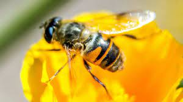

 
You will find here the material I use for my ***Latent Variables Models for ecology and biology*** class  in [Master 2  *Mathématiques pour les Sciences du Vivant*](https://sites.google.com/view/m2-msv/) of [University Paris Saclay](https://www.universite-paris-saclay.fr/en/education/master/mathematics-and-applications/m2-mathematiques-pour-les-sciences-du-vivant). 

 </img>

   
 

### Practical organization 
    
In 2026, the class will take place at **AgroParisTech, 22 place de l'Agronomie, Palaiseau** on wednesdays from **13:30 to 16:30**

  * 07/01/2026: Room C1.0.21
  * 14/01/2026: Room C1.0.21 or 23 (to confirm)
  * 21/01/2026: No class
  * 28/01/2026: Room C1.0.21 or 23 (to confirm)
  * 04/02/2026: Room C1.0.21 or 23 (to confirm)
  * 11/02/2026: Room C1.0.21 or 23 (to confirm)
  * 18/02/2026: Room C1.1.27
  * 25/02/2026: Room C1.1.27

 

### Evaluation 

The evaluation consists in a 3 hours exam  the 25th of March 2026.  Here are and [the exam of 2024](Ressources/examen_2024.pdf) and [the exam of 2025](Ressources/examen_2025.pdf)  .

 

 

*Last update on `r format(Sys.time(), '%d/%m/%y')` *

