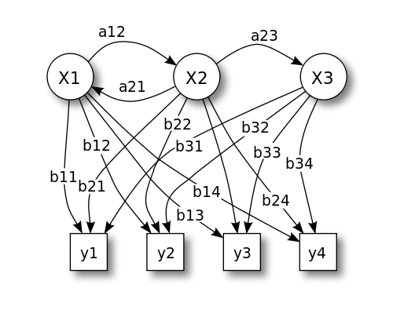

  
 
 

 </img>

The course is based on a book that we are writing currently with [Stéphane Robin](https://scj-robin.github.io/) and [Pierre Gloaguen](https://papayoun.github.io/).  Before the book is ready, you will find  some useful  slides below. Note that I won't always stick to these documents and may change some stuff.  

 

 

### Ressources  

*Last update on `r format(Sys.time(), '%d/%m/%y')` *

| Chapitre | Slides  | Illustration  | Ressources |
  |:-------------|:-------:|:--------|:------:| 
  | **Chap 1** : Latent variable models and EM |  [<i class="fa fa-download"></i>](./Ressources/Slides/Chap1_PresCours/LVM_pres.pdf)| [Adelie Penguins](./Ressources/IllustrationsRmd/Chap1_MixtureAdelie/Chap1_PalmerPinguins.html)| [Files](./Ressources/IllustrationsRmd/Chap1_MixtureAdelie.zip) | 
  | **Chap 2** : Explicit E step |  [<i class="fa fa-download"></i>](./Ressources/Slides/Chap2_LVM_GeneralDef/chap2_LVM_Mixtures.pdf) | [Bohemia Vegetation](./Ressources/IllustrationsRmd/Chap2_1_GaussianMixtureModel/Chap2_1_BohemiaVegetation.html)| [Files](./Ressources/IllustrationsRmd/Chap2_1_GaussianMixtureModel.zip)| 
  | |  | [Barents fishes](./Ressources/IllustrationsRmd/Chap2_2_ZeroInflatedPoisson/Chap2_2_BarentFishesZIP.html)| [Files](./Ressources/IllustrationsRmd/Chap2_2_ZeroInflatedPoisson.zip)| 
  | |  | [Exercice on Poisson Mixture](./Ressources/Slides/TP-EM-Poisson/TP_Poisson.pdf)| [Correction]()| 
  | **Chap 3** : Non explicit E step (HMM) |  [<i class="fa fa-download"></i>](./Ressources/Slides/Chap3_LVM_NonExplicitE/chap3_LVM_HMM.pdf) | To come | 
  | **Chap 4** : Approximated E step (Variational EM)|  [<i class="fa fa-download"></i>](./Ressources/Slides/Chap4_LVM_VariationalE/Slides_SBM_LBM/slides_SBM_LBM_intro/chap4_LVM_SBM_LBM.pdf) |  [Parasitism Ecological network ](https://sophiedonnet.github.io/IntroductionToBlockModels/TP_SBM/TutorialBM.html) |  |
  | **Chap5** : A gentle introduction to Variational probabilistic Autoencoder|  [<i class="fa fa-download"></i>](./Ressources/Slides/Chap5_VarAutoEncoder/SlidesVAE/chap5_LVM_VAE.pdf) | | 
  | **Chap 6** : Bayesien inference of Latent variable models |  [<i class="fa fa-download"></i>](./Ressources/Slides/Chap6_LBM_Bayesian/chap6_LVM_bayesian_main.pdf)  | [MCMC versus VEM on Poisson mixture](https://Sophiedonnet.github.io/BayesianClassMaterial/PoissonMixtureVBversusMCMC.html) | [Files](https://sophiedonnet.github.io/BayesianClassMaterial/PoissonMixtureVB.zip)

